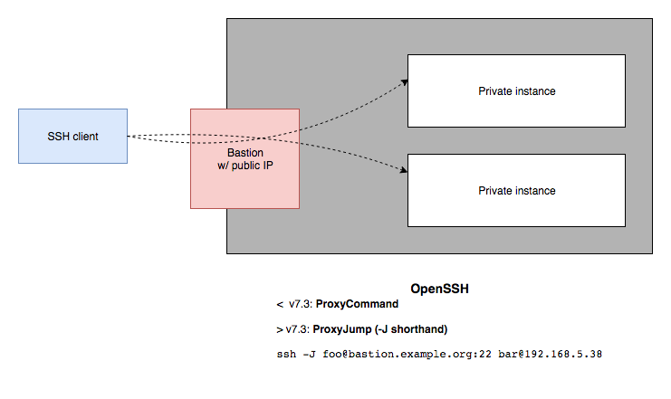

footer: ApacheCon North America 2017 - 17. May 2017
slidenumbers: true

#[fit] Terraform 
## Colonise the cloud!
### Stefan Magnus Landrø, BEKK Consulting AS

---

# Terraform 
 
- Commandline tool (go) (OS X, Windows, Linux, …)
- Developed by Hashicorp (Vagrant, Packer, Consul, Nomad)
- Lets you describe and provision cloud infrastructure using HCL formatted text files 
- Servers, networks, load balancing, storage, containers
- Multi-provider (AWS, Azure, GC, Cloudstack, …)

---

# Demo

- CloudStack @ Exoscale (Switzerland) 
- Web servers (CentOS/Linux)
- Bastion host for management/provisioning
- SSH public/private key
- Run Apache httpd web server
- Domain name (DNS) (AWS)

---

# Provider (1)

- A **provider** is used to connect to a cloud provider
- AWS, Azure, GC, Digital Ocean, Cloudstack, Openstack, Heroku, CloudFoundry, Mailgun, easyDNS, CloudFlare…
- **Providers** know the APIs and expose available services 

---

# Resource (2)

- A **resource** defines how to use a cloud resource/service
  - VM, IP-address, load balancer, network, firewall, object storage, DNS-record 
- The name of the provider is used as a **resource** name prefix
- **Resources** have unique ids
  - Combination of resource type and name

---

# Dependencies (3)

- A **resource** can depend on another **resource**
- Can determine the order of creation

---

# terraform show

- When manipulating **resources**, Terraform saves the current state i a .tfstate file (or S3, Consul)
- Knows a **resource's** current state in the cloud

        terraform show

---

# Syntax (4)

- Variables
- Interpolation
	- Functions (math, base64, join, lower, ...)
- Count

---

# provisioner (5)

- A **provisioner** lets you provision against the **resource** right after creation
  - chef
  - remote-exec (script run on the server)
  - local-exec (script run locally)

---

# terraform taint

- When **resources** have to be recreated from scratch, they have to be tainted

        terraform taint <resource_type>.<resource_id>

---

# Security first! (6)

- Connect to you web server through bastion host
- Limit access to bastion host to your IP range
- Use smart card to protect your private key 
  - E.g. yubikey as OpenPGP smartcard and gpg-agent emulating ssh-agent
  
---

  
  
---

# output (7)

- Outputs lets you define values that will be output when Terraform applies
- Can be queried easily:

        terraform output [-json]
         
---

# Multi-provider (8)

- Can connect **resources** from different cloud providers
- Unique feature in Terraform!

---

# Multi provider, multi datacenter, multi technology (9)

- DNS using weighted record set
  - Could have used latency / geolocation
- Health checks to determine data center (or service) outage

---

# Bonus: Dependency graph

- Dependency graphs can be generated dynamically

        terraform graph | dot -Tpng | open -f -a Preview

---

# Code

@landro
[github.com/landro](http://github.com/landro)
